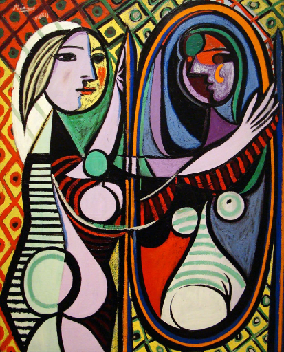

# Neural Style Transfer

Implementation of Neural Style Transfer algorithm as proposed by Leon Gatys et al. in “[A Neural Algorithm of Artistic Style](https://arxiv.org/abs/1508.06576)”.

> Note: The original authors used a [L-BFGS](https://en.wikipedia.org/wiki/Limited-memory_BFGS) optimizer, but we used [Adam](https://arxiv.org/abs/1412.6980) optimization instead.

The paper outlines an algorithm for merging the content of one image with the style of another image using convolutional neural networks (CNN). Below is an example that reimagines a photograph of Erykah Badu in the style of Pablo Picasso using a pretrained VGG19 CNN network:

## [View the Jupyter Notebook using nbviewer](https://nbviewer.jupyter.org/github/Bashkeel/neural-style-transfer/blob/main/Neural%20Style%20Transfer.ipynb)

---

Stylized Image |
:----------------------------------------------------------:|
  

The input images used were as follows:

Content Image              |  Style Image
:-------------------------:|:-------------------------:
  |  
The Queen of Neo-Soul, Erykah Badu | "Girl before a Mirror" by Pablo Picasso

 

## Hyperparameters to Tune
With certain outputs or sizes, you may need to fine tune certain hyperparameters

* Number of Iterations
* Layers: {Content, Style}
* Weights: {Content, Style, Total Variation}
* Adam: {Learning Rate, &Beta;1, &Beta;2, &epsilon;}   

## Dependencies:
* [Tensorflow](https://www.tensorflow.org/install)
* [os](https://docs.python.org/3/library/os.html)
* [IPython](https://ipython.org/install.html)
* [Matplotlib](https://matplotlib.org/3.3.2/users/installing.html)
* [Numpy](https://numpy.org/install/)
* [Pillow](https://pillow.readthedocs.io/en/stable/installation.html)
* [functools](https://docs.python.org/3/library/functools.html)
